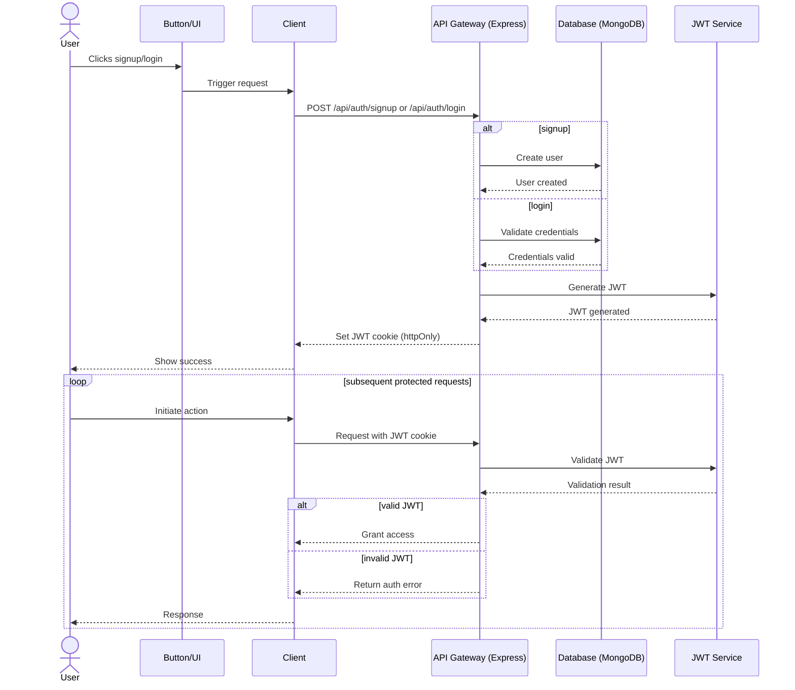

# ChatLingo

ChatLingo is a **language-learning chat platform** built with **MERN** + **Stream Chat**. It helps users communicate across languages by translating messages automatically based on each user's native language.

## ✨ One-line idea
ChatLingo lets people chat naturally, while the app handles language barriers in the background.

---

## 🧱 Tech Stack

### Frontend
- React 19 + Vite
- Tailwind CSS + DaisyUI
- TanStack Query
- Zustand
- Stream Chat React SDK + Stream Video SDK

### Backend
- Node.js + Express
- MongoDB + Mongoose
- JWT authentication (cookie-based)
- Stream Chat (server token generation + user sync)
- Translation service:
  - Google Translate API (if API key is provided)
  - MyMemory API fallback (no key required, rate-limited)

---

## ✅ Current Features
- Sign up / log in / log out
- User onboarding flow (profile basics + avatar)
- Recommended users discovery
- Send / accept friend requests
- View friends, incoming requests, and outgoing requests
- Generate Stream chat token
- Send automatically translated messages
- Update user profile

---

## 📁 Project Structure
```bash
chatLingo/
├── backend/      # Express API + MongoDB + Stream + translation
├── frontend/     # React app
└── package.json  # Root-level scripts
```

---

## ⚙️ Prerequisites
- Node.js 18+ (LTS recommended)
- npm
- MongoDB connection string
- Stream account (API key + secret)
- (Optional) Google Translate API key

---

## 🔐 Environment Variables
Create `backend/.env` and add:

```env
PORT=5001
MONGO_URI=your_mongodb_connection_string
JWT_SECRET_KEY=your_super_secret_jwt_key
STREAM_API_KEY=your_stream_api_key
STREAM_API_SECRET=your_stream_api_secret
GOOGLE_TRANSLATE_API_KEY=optional_google_translate_api_key
NODE_ENV=development
```

> If `GOOGLE_TRANSLATE_API_KEY` is not set, the server uses MyMemory as fallback.

---

## 🚀 Local Development Setup

### 1) Install dependencies
From the project root:

```bash
npm run build
```

> This installs dependencies for both backend and frontend, then builds frontend.

### 2) Start backend
```bash
cd backend
npm run dev
```

### 3) Start frontend
In a second terminal:

```bash
cd frontend
npm run dev
```

### 4) Open the app
- Frontend: `http://localhost:5173`
- Backend API: `http://localhost:5001`

---

## 📡 API Endpoints (Summary)

### Auth (`/api/auth`)
- `POST /signup`
- `POST /login`
- `POST /logout`
- `POST /onboarding` (protected)
- `GET /me` (protected)

### Users (`/api/users`) *(protected)*
- `GET /` (recommended users)
- `GET /friends`
- `PUT /profile`
- `POST /friend-request/:id`
- `PUT /friend-request/:id/accept`
- `GET /friend-requests`
- `GET /outgoing-friend-requests`

### Chat (`/api/chat`) *(protected)*
- `GET /token`
- `POST /send`

---

## 🔐 Authentication Workflow

The app uses JWT-based authentication with an HTTP-only cookie:

1. User submits **signup** or **login** from the client.
2. Backend validates input and talks to MongoDB.
3. If valid, backend creates a JWT and sets it in the `jwt` cookie.
4. Protected routes validate that cookie on each request.
5. If token is valid, access is granted; otherwise an error is returned.



---

## 🧪 Useful Scripts

### Root
```bash
npm run build
npm run start
```

### Backend
```bash
npm run dev
npm run start
```

### Frontend
```bash
npm run dev
npm run build
npm run preview
npm run lint
```

---

## 🛠️ Operational Notes
- Backend CORS origin is currently set to `http://localhost:5173`.
- Authentication relies on an HTTP-only cookie named `jwt`.
- Stream credentials are required; server startup fails without them.
- `frontend/README.md` is the default Vite README. This root README is the main project documentation.

---

## 📌 Suggested Next Improvements
- Docker Compose for one-command local startup
- CI workflow for linting and tests
- Rate limiting + centralized logging
- Better real-time UX (presence, typing indicators)
